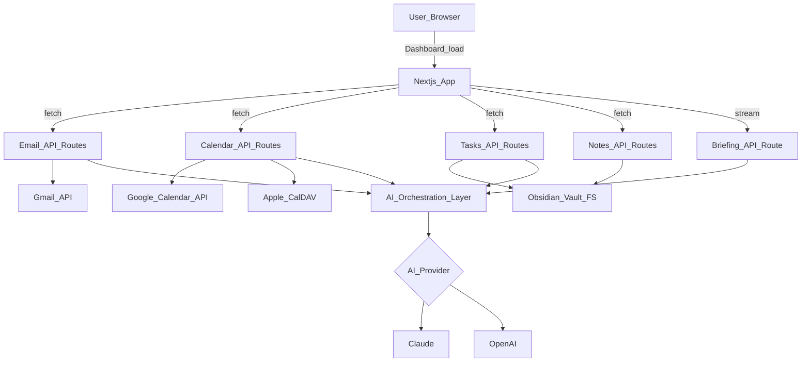

# ARIA — AI-Powered Personal Assistant Dashboard

[Deploy to Vercel](#deploy-to-vercel) · [Architecture](#architecture) · [Local setup](#local-setup) · [Demo mode](#demo-safe-mode)

An AI orchestration layer that consolidates **email**, **calendar**, **tasks**, and **notes** into a single intelligent dashboard — built as a portfolio demonstration of applied AI process engineering.

---

## Deploy to Vercel

**Before clicking Deploy, complete these two steps:**

1. **Get Google OAuth credentials** — you need a `GOOGLE_CLIENT_ID` and `GOOGLE_CLIENT_SECRET`. See [`docs/deploy-guide.md`](docs/deploy-guide.md) for a step-by-step walkthrough.
2. **Get an Anthropic API key** (optional) — if you want the AI layer to work with real data. Sign up at [console.anthropic.com](https://console.anthropic.com). Skip this if you're starting with `DEMO_MODE=true`.

**Recommended first deploy:** set `DEMO_MODE=true` in the Vercel env vars prompt. This lets you explore the full UI with realistic sample data before connecting your real accounts. Visit `/setup` after deploy to see a configuration checklist.

> **Test users:** ARIA uses a shared Google OAuth app. You must be added as a test user before signing in. After deploying, send your Vercel URL to the project owner to get added.

---

## What it does

- **Morning Briefing**: streams a cross-source briefing on page load (emails + calendar + tasks)
- **Email intelligence**: per-thread summary, urgency score, and one-click draft reply
- **Calendar analysis**: week view with conflict detection + agenda narrative
- **Obsidian tasks/notes**: reads your vault and surfaces today’s focus
- **⌘K command palette**: natural language → structured action routing
- **Model-agnostic AI layer**: switch Claude ↔ OpenAI via Settings (no code changes)

## Architecture

For more detail, see [`docs/architecture.md`](docs/architecture.md).

## AI integration design

ARIA is **not** a chatbot UI. AI runs as structured prompt chains:

- **Email processor**: summarize, urgency score, draft reply (`lib/ai/prompts/email.ts`)
- **Calendar analyzer**: conflicts + agenda narrative (`lib/ai/prompts/calendar.ts`)
- **Task prioritizer**: top-3 focus + scoring (`lib/ai/prompts/tasks.ts`)
- **Morning briefing**: cross-source synthesis, streamed (`lib/ai/prompts/briefing.ts`)
- **Command interpreter**: intent → action JSON (`lib/ai/prompts/command.ts`)

All model calls are routed through the abstraction in `lib/ai/`.

## Tech stack

| Layer | Tech |
|---|---|
| Frontend | Next.js 14 (App Router), React 18 |
| UI | Tailwind CSS, shadcn/ui patterns, sonner toasts |
| Auth | NextAuth v5 (Google OAuth) |
| APIs | Gmail + Google Calendar (`googleapis`), Apple CalDAV (`tsdav`) |
| AI | Anthropic SDK, OpenAI SDK (behind a unified interface) |
| Notes/Tasks | Obsidian vault filesystem |

## Local setup

**Requirements:** Node.js **18.18+** (see [`.nvmrc`](.nvmrc); use `nvm use` if you use nvm).

| Step | What to do |
|------|------------|
| 1 | Clone this repo and `cd` into the project root. |
| 2 | `npm install` |
| 3 | Create env file: either `npm run setup` (copies [`.env.example`](.env.example) → `.env.local` if missing) **or** `cp .env.example .env.local` |
| 4 | Fill in secrets: **either** edit `.env.local` **or** open [`http://localhost:3000/setup`](http://localhost:3000/setup) after starting the dev server once (wizard writes `.env.local`). |
| 5 | Set `NEXTAUTH_SECRET` (e.g. `openssl rand -base64 32` or the wizard’s **Generate** button). |
| 6 | **Google Cloud:** create **your own** project, enable Gmail + Calendar APIs, create an OAuth **Web client**, add redirect URI `http://localhost:3000/api/auth/callback/google`, then put `GOOGLE_CLIENT_ID` / `GOOGLE_CLIENT_SECRET` in `.env.local`. Details: [`docs/api-setup.md`](docs/api-setup.md). |
| 7 | Set `AI_PROVIDER` and the matching API key (`ANTHROPIC_API_KEY` and/or `OPENAI_API_KEY`), or configure Ollama. |
| 8 | Set `OBSIDIAN_VAULT_PATH` to an **absolute** path to your vault (tasks use Markdown `- [ ]` anywhere under that folder). Optional: `OBSIDIAN_REST_API_KEY` for the Local REST API plugin. |
| 9 | Optional: Apple Calendar — `APPLE_CALDAV_*` in `.env.local` ([`docs/api-setup.md`](docs/api-setup.md)). |
| 10 | If you used the wizard: **restart** the dev server so Next.js reloads env vars. Then `npm run dev`, sign in with Google, and open [`/api/health`](http://localhost:3000/api/health) to sanity-check config. |

**Security:** Never commit `.env.local` or real API keys. Each developer or machine needs **their own** Google OAuth client and keys.

**Google Auth and “GCP”:** Gmail and Google Calendar access require an OAuth client registered in Google Cloud. That is **some** Google Cloud project—not necessarily the original author’s. Self-hosted installs should use **their own** project. A shared client id/secret in a public repo is unsafe and impractical for restricted Gmail scopes. MCP or other wrappers do not remove that requirement.

**Setup wizard:** On **Vercel / production**, `/setup` shows a read-only configuration checklist with links to the Vercel dashboard — it does not write files. On **localhost dev**, the wizard writes `.env.local` directly.

## Demo-safe mode

For recording a public demo without leaking personal data:

- Set `DEMO_MODE=true` in `.env.local`
- Restart the dev server

When enabled, ARIA shows realistic mock data and **disables write actions** (send email, create tasks/notes/events, command writes).

## Portfolio context

This project is meant to demonstrate **AI orchestration and product thinking**: data ingestion, structured prompt chains, progressive enhancement, and model-agnostic design — not just “call an LLM and print text.”
