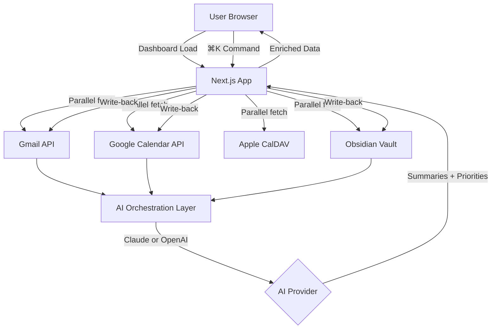

# Story 4.5 — Launch Prep: README, Architecture Diagram & Vercel Deploy

**Phase:** 4 — Polish & Demo Prep
**Depends on:** All other stories complete
**Estimated time:** 2–3 hours

---

## Context

This is the final story. ARIA is built and working. Now it needs to be properly packaged for portfolio presentation: a compelling README, an architecture diagram, a live Vercel deploy link, and a public GitHub repo. This is what engineering leads and technical recruiters will actually see when they click the LinkedIn post.

---

## What to Build

### 1. README.md

Write a professional, visually compelling README that clearly communicates:

```markdown
# ARIA — AI-Powered Personal Assistant Dashboard

[Live Demo](https://aria.vercel.app) | [Architecture Diagram](#architecture)

> An AI orchestration layer that consolidates email, calendar, tasks, and notes into a single intelligent dashboard — built as a portfolio demonstration of applied AI process engineering.

## What it does

[3-4 bullet points with GIF/screenshot of key features]

## Architecture

[Architecture diagram image]

ARIA is structured as a two-layer system...
[Brief architecture description linking to docs/architecture.md]

## AI Integration Design

This project demonstrates model-agnostic AI orchestration — not just API wrappers, but structured prompt chains that run automatically on data load:

- **Email Processor:** Per-thread summarization, urgency scoring, and draft reply generation
- **Calendar Analyzer:** Conflict detection and natural language agenda narratives  
- **Task Prioritizer:** Goal-aligned daily focus scoring
- **Morning Briefing:** Cross-source synthesis streamed to the dashboard on load
- **Command Interpreter:** Natural language → structured action routing via ⌘K

The AI layer abstracts Claude and OpenAI behind a unified interface — switching models requires only an environment variable change.

## Tech Stack

[table: Next.js, Tailwind, shadcn/ui, Anthropic SDK, OpenAI SDK, NextAuth, googleapis, tsdav]

## Setup

[Step-by-step setup instructions referencing docs/api-setup.md]

## Portfolio Context

[1 paragraph about what this demonstrates professionally]
```

### 2. Architecture diagram

Create a visual architecture diagram. Options:
- **Mermaid diagram** in the README (renders on GitHub):

```markdown

```

### 3. Vercel deployment

```bash
# Install Vercel CLI
npm install -g vercel

# Deploy
vercel --prod
```

When deploying to Vercel:
1. Set all environment variables from `.env.example` in the Vercel dashboard (Settings → Environment Variables)
2. The Obsidian and Apple Calendar integrations will only work locally — make sure `DEMO_MODE=true` is set on Vercel for the live demo link
3. Add the Vercel domain to Google OAuth's authorized redirect URIs: `https://your-app.vercel.app/api/auth/callback/google`

### 4. GitHub repo setup

```bash
# Initialize and push
git init
git add .
git commit -m "feat: ARIA v1.0 — AI-powered personal assistant dashboard"
git remote add origin https://github.com/dherron16/aria-dashboard.git
git push -u origin main
```

Add to `.gitignore`:
```
.env.local
.aria-settings.json
node_modules/
.next/
```

### 5. LinkedIn post draft

Write a LinkedIn post in a file called `docs/linkedin-post.md`:

```markdown
I built ARIA — an AI-powered personal dashboard that replaces my tab-switching workflow.

What it does:
→ Auto-reads and summarizes my inbox on load (no clicking)
→ Pre-drafts email replies I can send in one click
→ Detects calendar conflicts before I notice them  
→ Surfaces my top 3 tasks for the day from my Obsidian vault
→ Streams a full morning briefing on open

What I'm most proud of architecturally:
The AI layer is fully model-agnostic — Claude and OpenAI sit behind the same interface. Switching providers is one environment variable.

Stack: Next.js, Tailwind, shadcn/ui, Anthropic SDK, OpenAI SDK, NextAuth, Gmail API, Google Calendar, Apple CalDAV

[Live demo: link] | [GitHub: link] | [Video: link]

Built in 3 weeks as a portfolio project demonstrating AI process engineering — not just prompting, but orchestration.

#AI #MachineLearning #SoftwareEngineering #BuildInPublic
```

### 6. Record the demo video

Checklist for the recording:
- [ ] `DEMO_MODE=true` is set — no real personal data visible
- [ ] Run `npm run dev` and open `localhost:3000`
- [ ] Sign in (use a test Google account)
- [ ] Wait for briefing to stream in (~5 seconds)
- [ ] Show email widget: urgency badges, click a thread to show draft reply
- [ ] Press ⌘K → type "add task: review PR by tomorrow" → show task appear
- [ ] Show calendar widget with events and agenda narrative
- [ ] Navigate to Settings → switch AI provider from Claude to OpenAI → show it still works
- [ ] Total runtime: target 60–90 seconds

---

## Acceptance Criteria

- [ ] `README.md` is polished and contains architecture diagram, feature list, and setup instructions
- [ ] Mermaid architecture diagram renders on GitHub
- [ ] App is deployed to Vercel with `DEMO_MODE=true`
- [ ] Vercel deploy link is publicly accessible and loads the demo
- [ ] GitHub repo is public at `github.com/dherron16/aria-dashboard`
- [ ] `.gitignore` excludes all secrets and local config
- [ ] LinkedIn post draft is written

---

## Files Created/Modified

- `README.md` (new — root of project)
- `docs/linkedin-post.md` (new)
- `.gitignore` (updated)
- Vercel configuration via Vercel dashboard
